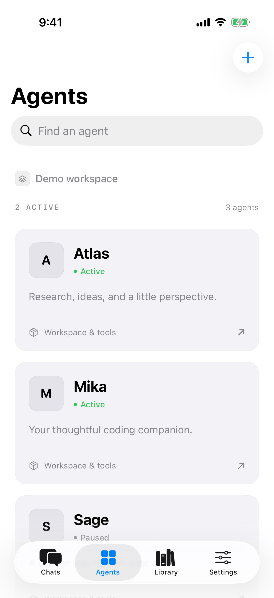
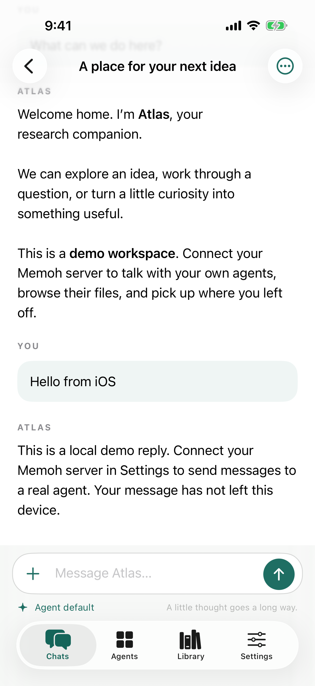
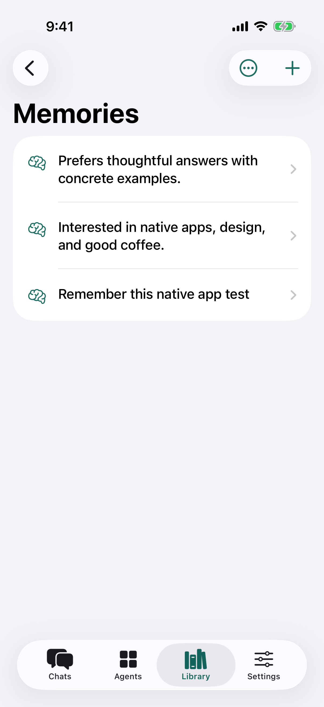
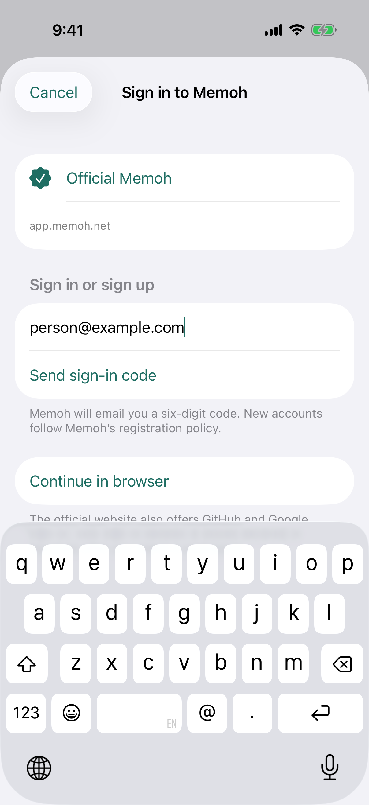
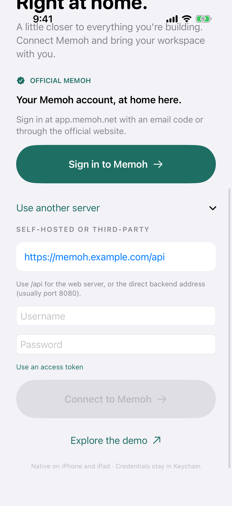

# Validation record

Implementation baseline: Memoh `51bb2073d8d99c961ce9f23555e8fb3bdd2aadc4`, inspected on 17 September 2026. Toolchain: Xcode 26.6, Swift 6.3.3 in Swift 5 language mode. Deployment target: iOS 17.0. App identifier: `ad.neko.homem`.

## Completed checks

- Xcode Cloud Build 1 (`7273dd7`) passed both the required simulator test action on iPhone 17 Pro / iOS 27 and the iOS archive action. The archive reported zero errors and warnings.

- iPhone simulator Debug build succeeded with the pinned SwiftTerm and WebRTC packages.
- Final rebuilt app passed Xcode bundle validation with `ad.neko.homem` and all license resources present.
- `TestResults/FinalCore.xcresult`: **15 tests passed, zero failures, zero skips** — 10 core tests, three networking tests, and two real HTTP/SSE/WebSocket integration tests on iPhone 17 Pro / iOS 26.5. This run includes the final streaming fix.
- `TestResults/Second.xcresult`: **14 tests passed, zero failures** — 12 core/network tests and two native UI flows on iPhone 17 Pro / iOS 26.5.
- The UI flows sent a demo message, opened the agent workspace and its text editor, created a memory, and navigated provider settings. The attached screenshots were exported and visually inspected.
- A native URLSession probe reproduced Swift's removal of empty lines by `AsyncBytes.lines`. The corrected byte parser then successfully decoded all three SSE progress/completion frames from the local fixture. A regression test covers LF, CRLF, CR, and multibyte text.
- `bash scripts/wire-smoke.sh` passed using the unchanged app networking/runtime source compiled for macOS: real HTTP authentication and bot listing, SSE progress/completion, and WebSocket admission, snapshots, deltas, history reconciliation, and duplicate suppression.

Screenshots from the passing UI run:

| Agents | Chat | Memory creation |
|---|---|---|
|  |  |  |

## Official sign-in update — 17 September 2026

- Inspected the public app.memoh.net login page and deployed client. Its platform endpoints are `/api/v1/auth/email-code/send`, `/api/v1/auth/email-code/verify`, `/api/v1/auth/verify-mfa`, `/api/v1/users/me`, `/api/v1/teams`, and `/api/v1/ws-tickets`; native workspace requests use `/api/memoh`. The live unauthenticated config confirms email login and GitHub/Google providers.
- Simulator build succeeded. `build/Logs/Test/Test-Homem-2026.09.17_14-06-39-+0900.xcresult`: **23 tests passed, zero failures, zero skips** on iPhone 17 Pro / iOS 26.5 (19 core/network/integration tests and four UI tests).
- New protocol tests verify email-code payloads, server resend cooldown, cookies set on verification, MFA challenges and rejection, nested workspace membership responses, official cookie isolation/expiry/serialization, one-time WebSocket tickets, and expired-session handling without the third-party bearer refresh endpoint.
- The simulator verifies that official sign-in is primary, invalid email cannot request a code, valid email enables the action, cancellation works, and custom server credentials remain reachable. Screenshots from the passing run were inspected.
- No email was sent to a production address, and no live account or social-provider authentication was completed. Real email delivery, workspace operations after live login, and provider acceptance of the embedded browser remain unverified. Email sign-in does not rely on an embedded OAuth flow.

| Official email sign-in | Custom server sign-in |
|---|---|
|  |  |

## Chat and login polish — 17 September 2026

- Replaced the generated session form with a message composer, attachments, agent selector, and named workspace targets. The first message is queued with its target before the socket starts; a real WebSocket fixture verifies delivery exactly once with attachment data and the selected target intact.
- Replaced the list-level delete popover with a centered, named alert and explicit Cancel. Swipe actions no longer optimistically remove a row before confirmation.
- Removed the floating keyboard Done toolbar. Dismissal lives in the chat composer, and new-chat actions remain above the keyboard.
- Replaced hard-coded teal with a persisted accent preference shared throughout the app. System/light/dark appearance remains independent. Memoh web themes are browser-local, so native choices are configured in Settings.
- Shortened onboarding, focused email entry, added automatic six-digit verification and single-workspace entry, and added browser loading/error recovery.
- Full simulator run `Test-Homem-2026.09.17_17-07-08-+0900.xcresult`: **26 tests passed**, zero failures/skips. Final targeted run `Test-Homem-2026.09.17_17-10-27-+0900.xcresult`: **three UI tests passed**, including run-location selection, deletion cancellation, keyboard dismissal, and persistence of Dark/Rose across relaunch. This adds a 27th distinct test to the suite.
- After pinning new-chat actions above the keyboard, both composer and theme tests passed again in `Test-Homem-2026.09.17_17-12-33-+0900.xcresult`.
- New chat, delete confirmation, keyboard composer, official email login, and dark appearance screenshots were exported and visually inspected. No production email or model request was sent during these checks.

## TestFlight release

- Xcode Cloud build **9**, source commit `56cd461`, successfully archived and completed App Store processing on 17 September 2026. Version **1.0.0 (9)** was assigned to **Homem Internal** (three testers).
- External submission is held by Apple's one-build-per-version review rule while build 8 awaits Beta App Review. Build 9 is not claimed as available to external testers.

## Agent menu refinement

- Chats, New Chat, and Library now use a top-right avatar menu reflecting the selected agent, with a checkmarked agent list and a spoken selected-agent value.
- The targeted new-chat UI test passed on iPhone 17 Pro / iOS 26.5 (`Test-Homem-2026.09.17_17-25-55-+0900.xcresult`). It changes Atlas to Mika, verifies the selected agent and reset run location, sends the first message, and dismisses the composer keyboard. The updated screenshot was inspected.

## Bot and workspace identities — 17 September 2026

- Bot avatars now use the server's `avatar_url` throughout chat, agent details, library, and the toolbar dropdown. The official workspace picker and signed-in workspace identity use the team's `avatar_url`; user profile images are also displayed.
- Public images load without API credentials. Private images use credentials only on the exact server origin, with redirects blocked. Image reads are size-limited; raster images are downsampled off the main actor and cached in memory. HTTP(S), server-relative, and data URLs are supported, including SVG artwork rendered with scripts and network access disabled. Missing or invalid images fall back to initials or a workspace symbol.
- Reworked the main screens around identity, compact metadata, stronger typography, and quieter surfaces, using Flighty's information hierarchy as a visual reference. Removed the promotional headings and name-based fake avatars. The user's appearance and accent settings still apply.
- iPhone 17 Pro / iOS 26.5: **23 tests passed**, zero failures (`Test-Homem-2026.09.17_19-53-06-+0900.xcresult`), covering image decoding, URL resolution, official sign-in, dropdown selection, first-message sending, deletion cancellation, workspace files, and Dark/Rose persistence. Screenshots of both anchored dropdowns, chat setup, the chat list, agents, and dark mode were exported and inspected.
- iPad (A16): the new-chat/dropdown/keyboard flow and 16 core/sign-in checks passed in `Test-Homem-2026.09.17_19-55-52-+0900.xcresult`. The iPad floating-tab accessibility selector was corrected for the theme test; the final theme and valid/invalid image checks both passed in `Test-Homem-2026.09.17_19-57-33-+0900.xcresult`.

## Design-language refinement

- Inspected Flighty's published iPhone screenshots and detail views, and translated the hierarchy into [Homem's design rules](DESIGN.md). Shared canvas/surface tokens, restrained labeled status dots, flat conversation rows, compact context, and a clean writing surface now govern the main screens.
- Six iPhone UI flows passed in `Test-Homem-2026.09.17_20-02-49-+0900.xcresult`. The workspace-tools test exposed SwiftUI combining multiple navigation links within a List row; the controls now use independent button routing. The corrected chat/workspace/file-opening flow passed in `Test-Homem-2026.09.17_20-07-11-+0900.xcresult`.
- All three final iPad flows (chat/workspace files, new chat/dropdowns/keyboard, and Dark/Rose persistence) passed in `Test-Homem-2026.09.17_20-08-14-+0900.xcresult`. Workspace-tool and keyboard-visible dark screenshots were inspected.
- Updated chat, agent, composer, and dropdown screenshots were exported and visually inspected, including Dark/Rose. Demo screenshots show the neutral fallback identities; server-configured images are used when present.

## Compact activity, workspace access, and localization — 17 September 2026

- Agent details place the name beside the avatar and expose Files, Terminal, and Desktop directly. Consecutive tool calls collapse into a single compact activity row; approvals remain visible. Private same-origin and SVG avatars are supported with scoped credentials and isolated rendering.
- L10n-swift 5.10.3 powers app-owned copy in Simplified Chinese, Spanish, and Japanese. The catalog check validates 431 strings across app and permission catalogs, including format placeholders. All three locale flows, compact activity, and Dark/Rose appearance were visually inspected on iPhone and iPad.
- All 11 iPhone UI tests passed in `Test-Homem-2026.09.17_21-24-14-+0900.xcresult`; its three wire integration tests also passed. A localization assertion was corrected to distinguish a translated UI label from a user-authored agent name.
- Final iPad run `Test-Homem-2026.09.17_21-28-34-+0900.xcresult`: **32 tests passed, zero failures** (27 core/network/sign-in/presentation/desktop checks and five UI flows). The standalone HTTP/SSE and WebSocket wire smoke checks and Cloud preflight passed.
- Desktop startup now prepares legacy hosted workspaces, polls actual readiness, allows cold-start negotiation, cleans up old sessions, and provides recovery for connection or first-frame timeouts. A real local WebRTC peer verifies native offer/answer negotiation, receipt of a remote video track, input mapping, and session cleanup. The authenticated official web desktop rendered successfully during inspection. Physical-device native video rendering against the hosted server remains unverified; the local peer test does not generate video frames.

## Reproduce

Run `bash scripts/test.sh` from the project root, setting `HOMEM_TEST_DESTINATION` to an installed iOS simulator if needed. This starts the loopback fixture and runs the XCTest targets. Result bundles are local build artifacts and are excluded from source control.

For a simulator-independent transport check on the Mac, start `python3 scripts/fixture-server.py`, then run `bash scripts/wire-smoke.sh`. This compiles the app's actual `APIClient`, `ChatModel`, runtime reducer, and JSON types without substituting a mock transport. The fixture itself is a small contract test server, not Memoh.

## Verification limits

- Native production account, model provider, container runtime credentials, and OAuth registration were not supplied to the app tests. The official public login, deployed client, and signed-in browser desktop were inspected. Local fixture results establish client transport behavior, not end-to-end compatibility with every deployment.
- An intermediate expanded simulator run became unresponsive during UI automation and was stopped. Its wire tests had skipped after a two-second fixture startup timeout. The subsequent final core run used a longer allowance and passed both wire tests without skips. The additional onboarding screenshot test subsequently passed in Xcode Cloud Build 1.
- iPad (A16) / iOS 26.5: new-chat/run-location/keyboard and delete-confirmation tests passed in `Test-Homem-2026.09.17_17-15-00-+0900.xcresult`; screenshots were inspected. Other iPad feature screens remain outside this focused visual check.
- Xcode Cloud signing and internal TestFlight distribution are verified. Physical-device installation, public App Store release, accessibility audit, and the oldest supported OS remain release checks.
- See [FEATURES.md](FEATURES.md) for the explicit limits on desktop parity, specialized renderers, provider authentication, backup import, and background behavior.
