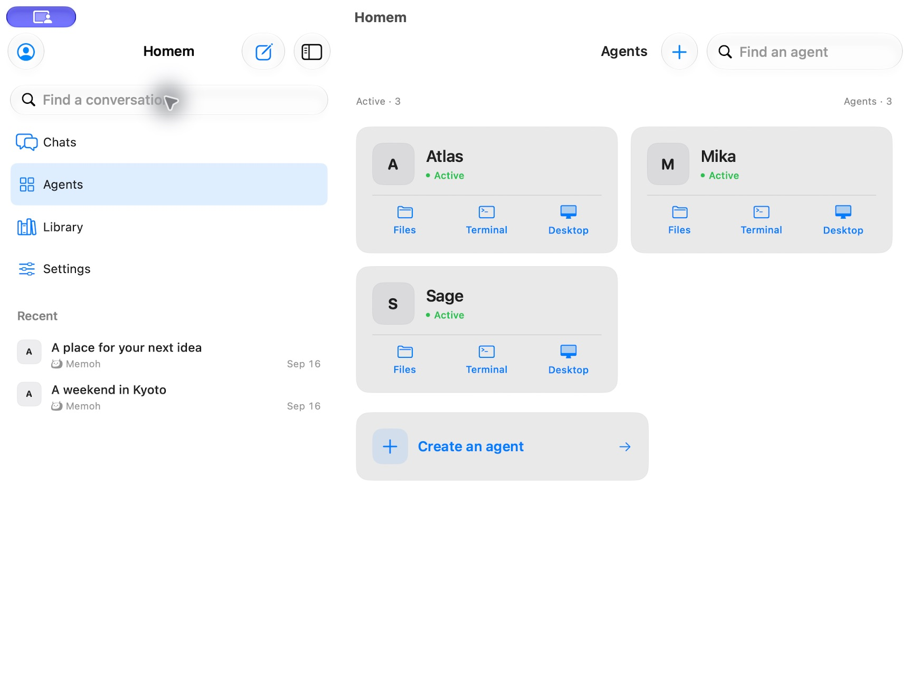
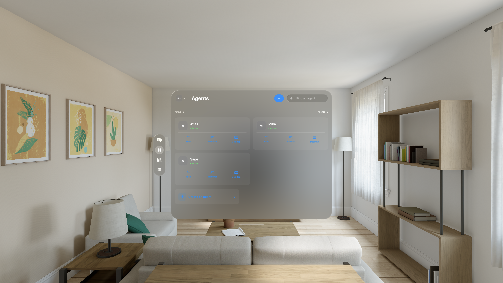

# Mac and visionOS UI review — 3 October 2026

## Changes

- Mac uses one persistent sidebar for Chats, Agents, Library, Settings, and recent conversations. Switching sections keeps the chat draft and pane state alive, with the correct page title and toolbar.
- Mac's Workspace menu offers separate Chat, Files, Terminal, and Desktop windows alongside the existing split panes. New windows keep the account and agent from their source window. Independent windows can use different monitors.
- Mac tool windows use compact navigation titles and a readable account footer. Native window titles identify the tool and agent, making windows easy to find in the Window menu and across displays.
- Agent cards on Mac and visionOS fit their content, omit unavailable resource measurements, and use a compact create action below the grid.
- visionOS conversation rows have larger avatars and grouped spacing. Custom controls retain native hover feedback without nested button surfaces.
- New visionOS tool windows initially appear beside a visible workspace window. This fixes the overlap that prevented tapping agent details after opening Terminal.

## Mac shortcuts

| Action | Shortcut |
| --- | --- |
| Chats / Agents / Library / Settings | Command–1 / 2 / 3 / 4 |
| New Chat window | Command–Shift–N |
| New Files window | Command–Shift–F |
| New Terminal window | Command–Shift–T |
| New Desktop window | Command–Shift–D |

The chat toolbar's Workspace menu contains **New window** and **Add pane** sections. Window placement, full screen, and moving between displays use the native macOS Window menu.

## Verification

- Local Debug builds succeeded for `Homem` (iOS Simulator), `HomemCatalyst` (Mac Catalyst with development signing), and `HomemVision` (visionOS Simulator) using Xcode 27.
- On Mac, Command–2/1 switched between Agents and chat while retaining a typed draft and an enabled Send button. Agents, Library, and Settings showed their own titles without the chat's toolbar.
- Command–Shift–F opened an independent Files window with the same account and Atlas workspace; Command–Shift–N opened the selected conversation in an independent Chat window.
- From Mika’s agent details, Command–Shift–F opened **Files · Mika**, independent of the globally selected Atlas agent. The native Window menu listed **Agents · Homem**, **Files · Atlas**, and **Files · Mika**.
- A separate Files window was moved using **Window → Move to Built-in Retina Display**. The window inventory confirmed Files on display 0 while chat with a Files split pane stayed on display 1. The Files window also restored on display 0 after restarting the app.
- visionOS UI checks `testAgentToolShortcutsOpenNativeWindows` and `testChatAndFilesUseNativeWindowsWithoutSplitControls` passed: two tests, zero failures. These exercise the real fixture login and native window actions.
- Five affected iOS UI flows passed in targeted runs: Chinese, Spanish, theme persistence, creating memory/schedule navigation, and expanded tool activity. Japanese encountered a keyboard-focus failure during sign-in; the username scroll correction compiled successfully, but its final rerun stalled in simulator installation before executing a test.
- A further three-test visionOS rerun also stalled in simulator installation before executing tests. It does not certify account switching or independent chat selections. Only the two completed visionOS checks above are counted as passing.
- Localization coverage passed for all 741 strings in Chinese, Spanish, and Japanese.

The first Xcode Cloud runs used the earlier `9f073cc` source and failed; [Cloud results](../../XCODE_CLOUD.md) distinguish them from these local checks. The UI changes have not replaced the Mac build already waiting for App Review.

## Screenshots

Actual development app and simulator captures using a local fixture account. They are UI review evidence, not replacement App Store marketing images. The fixture does not implement a terminal WebSocket, so the Terminal capture includes its connection error. visionOS was checked in the simulator; no physical Vision Pro was used.

- [Mac Agents](mac-agents.png)
- [Mac chat and Files split pane, display 1](mac-chat-split.png)
- [Mac independent Files window, display 0](mac-files-window.png)
- [Mac Files window opened from Mika’s agent page](mac-files-mika.png)
- [visionOS Agents](vision-agents.png)
- [visionOS conversation launcher](vision-chats.png)
- [visionOS chat beside its launcher](vision-chat.png)
- [visionOS tool window beside agent details](vision-multiple-windows.png)

